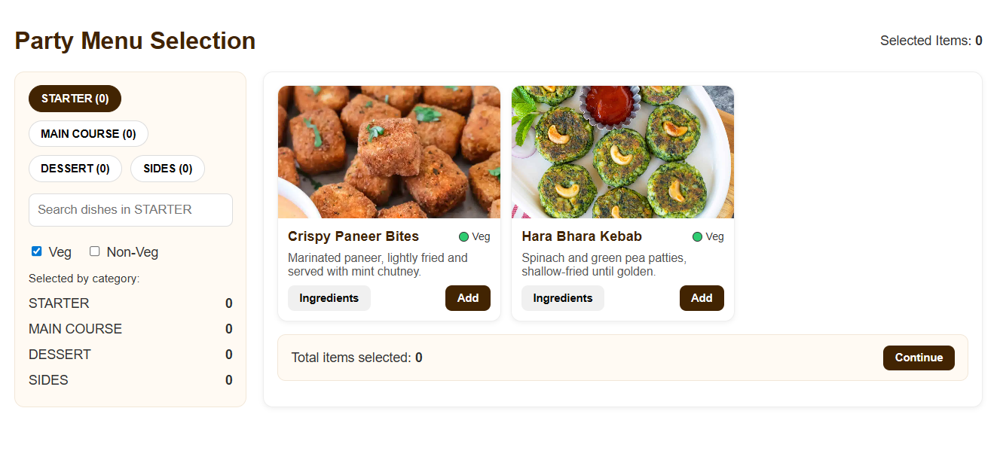

# 🍴 Party Menu App

A React-based web application for selecting dishes for a party menu.  
Implements filtering, veg/non-veg categorization, ingredient details, and selection summary.

## 📸 Demo



---

## 🚀 Features

-   Browse dishes by category (Starters, Main Course, Desserts, Sides).
-   Search within a category.
-   Filter by Veg 🟢 or Non-Veg 🔴.
-   Add/Remove dishes from selection.
-   Responsive design (works on desktop & mobile).

---

## 🛠️ Tech Stack

-   React (with hooks)
-   React Router DOM
-   CSS for styling
-   Mock data stored in `/src/data/mockDishes.js`

---

## 📂 Project Setup

### 1. Clone the repo

```bash
git clone https://github.com/peninsula101/party-menu-app.git
cd party-menu-app
```
